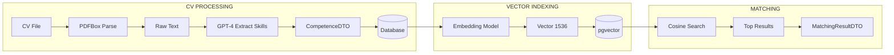
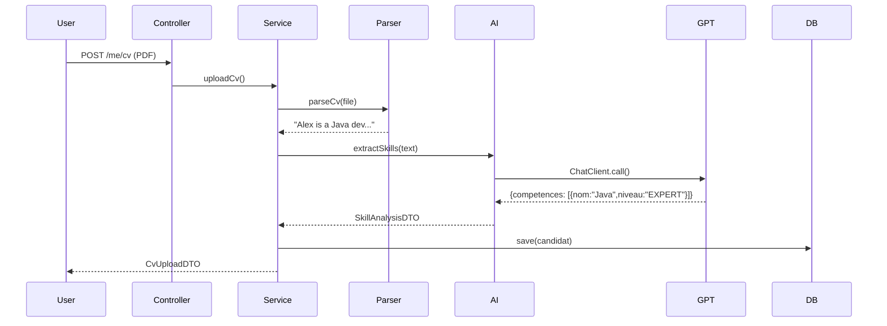
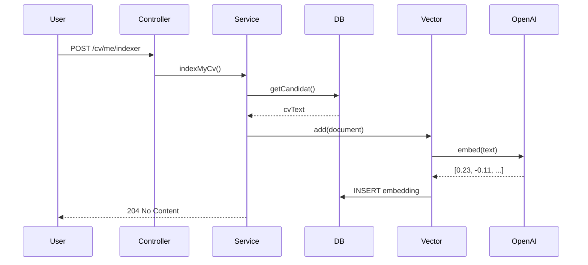
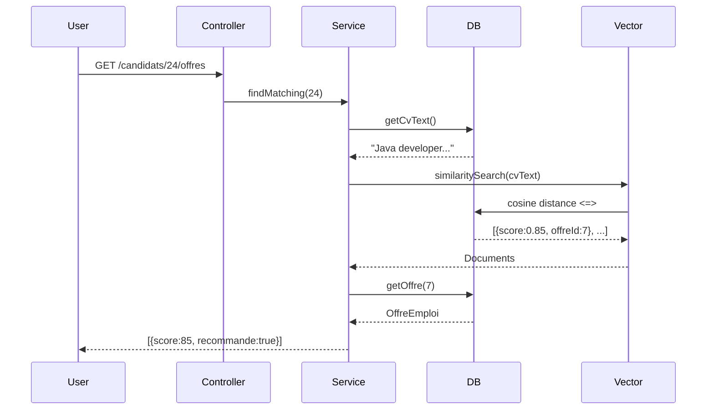
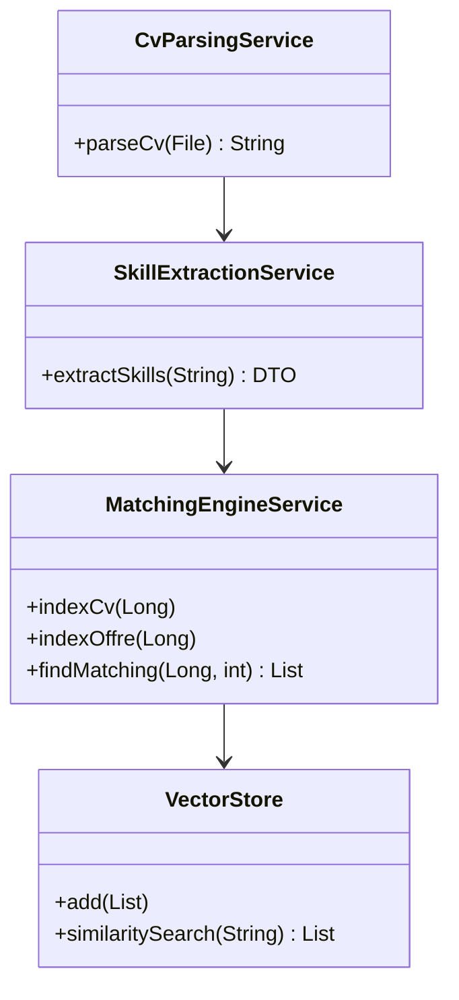
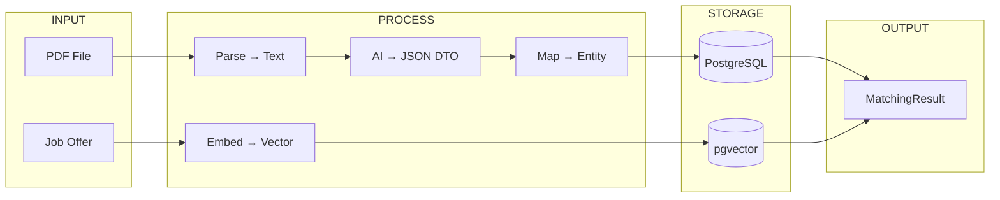

# AI & Matching - Minimal (Mermaid)

## 1. Complete Flow

## 2. CV Upload Sequence

## 3. Vector Indexing

## 4. Semantic Search

## 5. AI Components Class Diagram

## 6. Data Transformations

