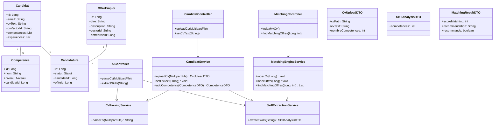

# Class Diagram - Minimal (Mermaid)

```mermaid
classDiagram
    %% ========== ENTITIES ==========
    class Candidat {
        +id: Long
        +email: String
        +cvText: String
        +cvVectorId: String
        +competences: List
        +experiences: List
    }

    class Competence {
        +id: Long
        +nom: String
        +niveau: Niveau
        +candidatId: Long
    }

    class OffreEmploi {
        +id: Long
        +titre: String
        +description: String
        +vectorId: String
        +entrepriseId: Long
    }

    class Candidature {
        +id: Long
        +statut: Statut
        +candidatId: Long
        +offreId: Long
    }

    %% ========== SERVICES ==========
    class CandidatService {
        +uploadCv(MultipartFile) CvUploadDTO
        +setCvText(String) void
        +addCompetence(CompetenceDTO) CompetenceDTO
    }

    class SkillExtractionService {
        +extractSkills(String) SkillAnalysisDTO
    }

    class MatchingEngineService {
        +indexCv(Long) void
        +indexOffre(Long) void
        +findMatchingOffres(Long, int) List
    }

    class CvParsingService {
        +parseCv(MultipartFile) String
    }

    %% ========== CONTROLLERS ==========
    class CandidatController {
        +uploadCv(MultipartFile)
        +setCvText(String)
    }

    class MatchingController {
        +indexMyCv()
        +findMatchingOffres(Long, int)
    }

    class AIController {
        +parseCv(MultipartFile)
        +extractSkills(String)
    }

    %% ========== DTOs ==========
    class CvUploadDTO {
        +cvPath: String
        +cvText: String
        +nombreCompetences: int
    }

    class SkillAnalysisDTO {
        +competences: List
    }

    class MatchingResultDTO {
        +scoreMatching: int
        +recommendation: String
        +recommande: boolean
    }

    %% ========== RELATIONSHIPS ==========
    Candidat "1" -- "N" Competence
    Candidat "1" -- "N" Candidature
    OffreEmploi "1" -- "N" Candidature

    CandidatController --> CandidatService
    MatchingController --> MatchingEngineService
    AIController --> CvParsingService
    AIController --> SkillExtractionService

    CandidatService --> CvParsingService
    CandidatService --> SkillExtractionService
    MatchingEngineService --> SkillExtractionService
```
