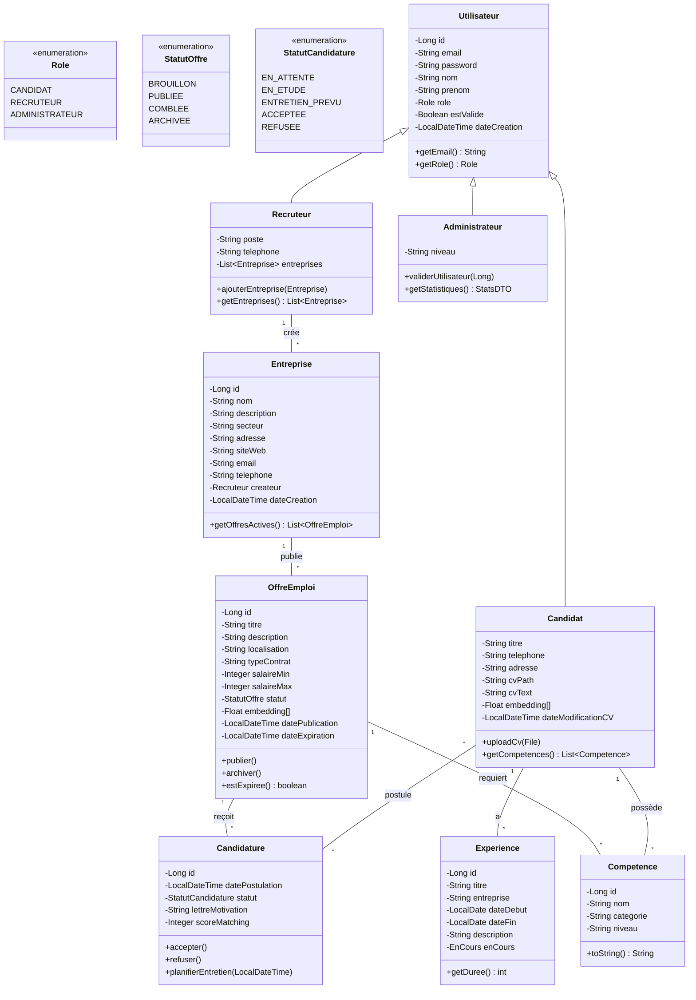
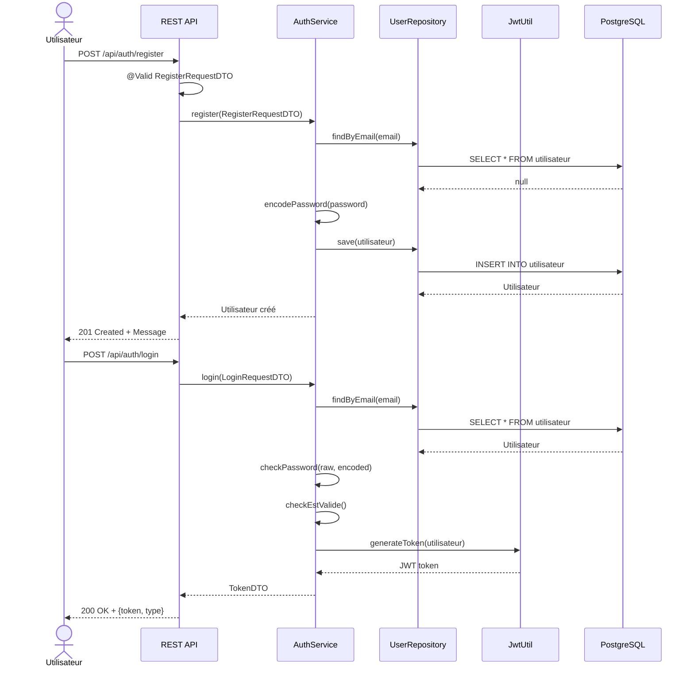
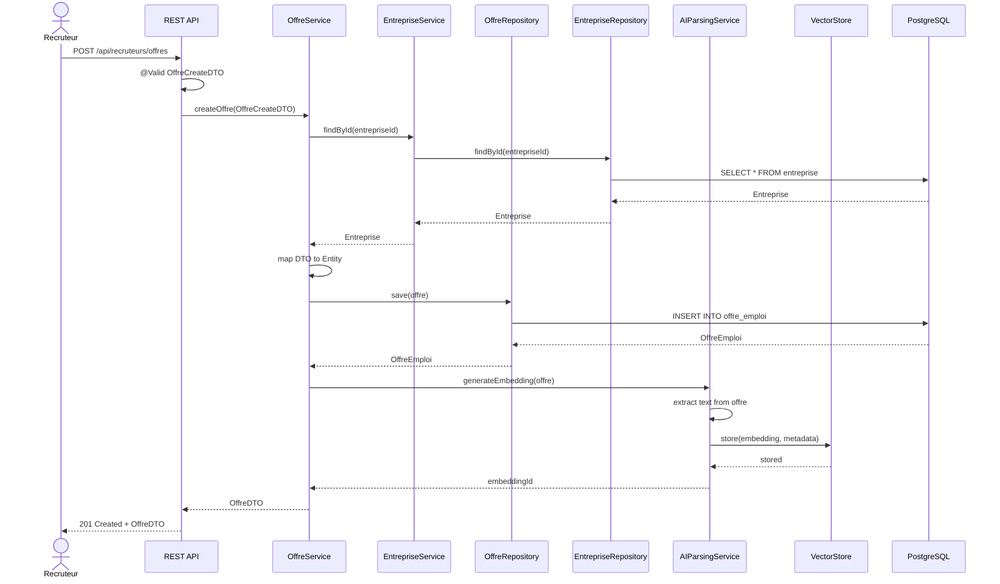
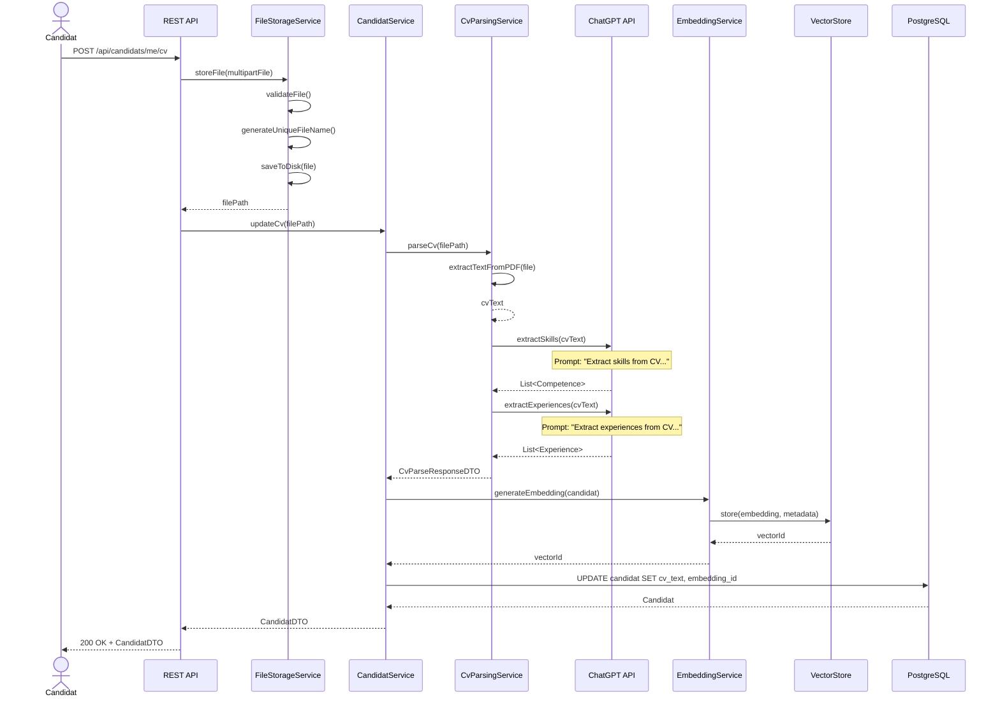
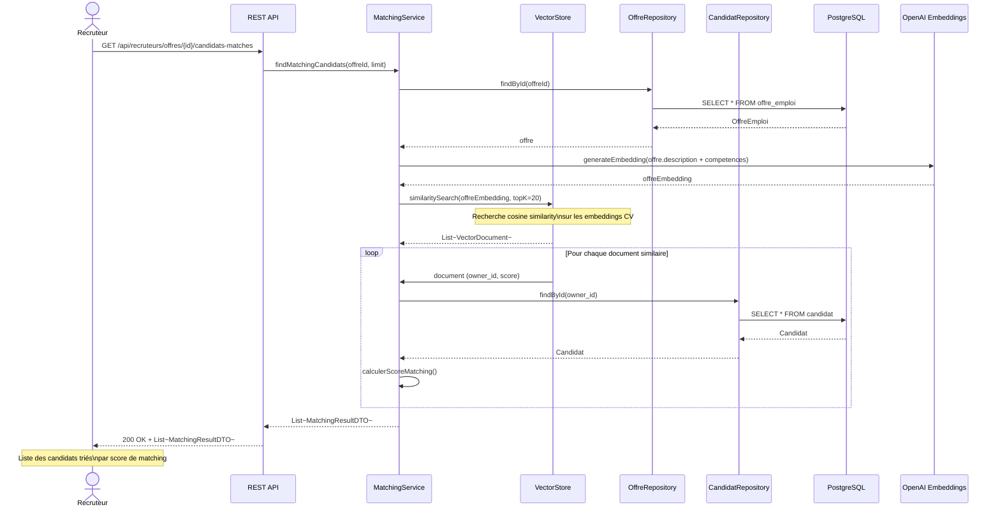
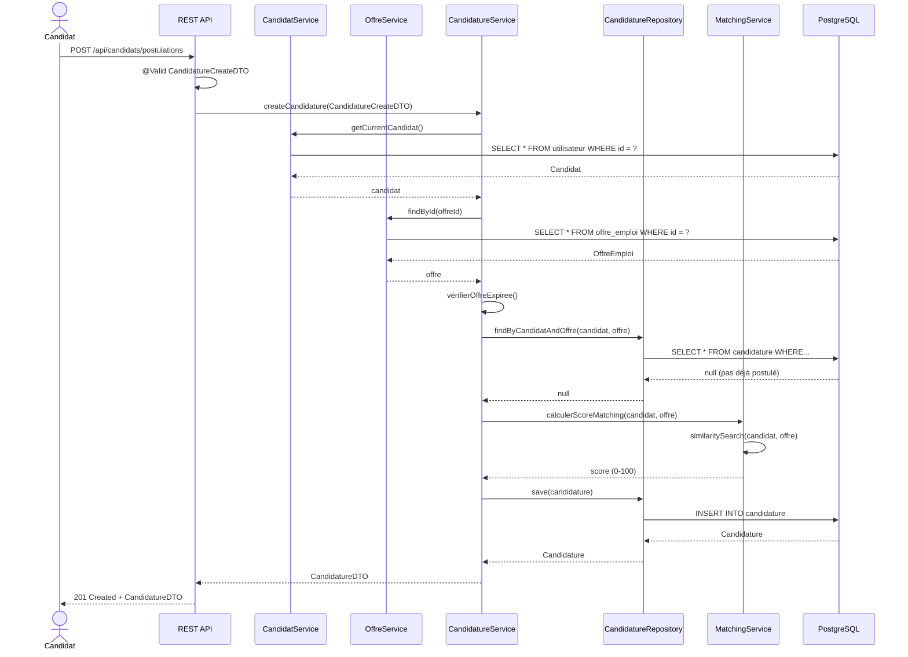
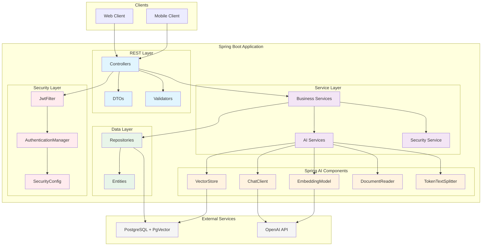
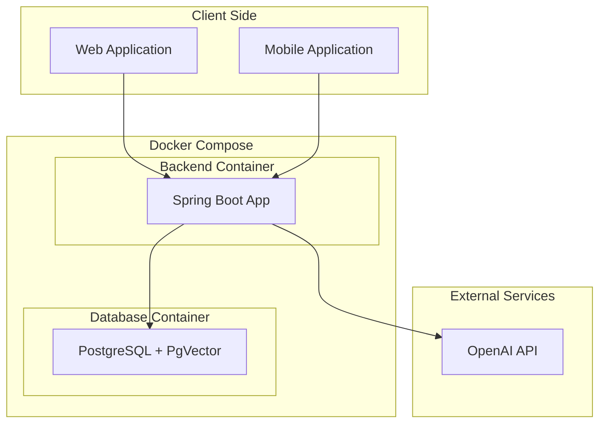

# Architecture UML - Plateforme de Recrutement Intelligente

## 1. Diagramme de Classes UML

---

## 2. Diagramme de Séquence - Inscription / Connexion

---

## 3. Diagramme de Séquence - Création d'une Offre

---

## 4. Diagramme de Séquence - Upload CV & Parsing IA

---

## 5. Diagramme de Séquence - Matching IA Candidat ↔ Offre

---

## 6. Diagramme de Séquence - Postulation à une Offre

---

## 7. Diagramme de Composants Spring Boot + Spring AI

---

## 8. Diagramme de Déploiement

---

## 9. Résumé des Diagrammes

| Diagramme | Description |
|-----------|-------------|
| **Diagramme de Classes** | Modèle de données complet avec toutes les entités et leurs relations |
| **Séquence - Inscription/Connexion** | Flux d'authentification JWT |
| **Séquence - Création Offre** | Publication d'une offre avec génération d'embedding |
| **Séquence - Upload CV** | Parsing IA du CV avec extraction de compétences |
| **Séquence - Matching** | Recherche vectorielle pour matching candidat/offre |
| **Séquence - Postulation** | Création d'une candidature avec score de matching |
| **Composants** | Architecture Spring Boot + Spring AI |
| **Déploiement** | Infrastructure Docker Compose |
