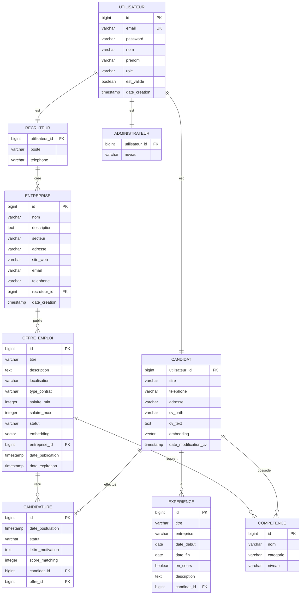
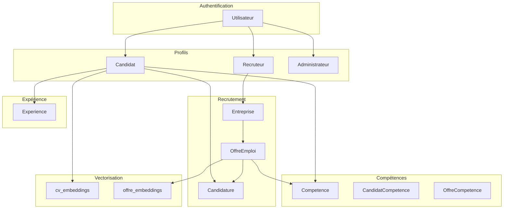

# Modèle de Données - Plateforme de Recrutement Intelligente

## 1. Modèle Conceptuel de Données (MCD)

### 1.1 Vue d'Ensemble

Le MCD représente la structure conceptuelle des données de la plateforme de recrutement.



---

## 2. Modèle Logique de Données (MLD)

### 2.1 Tables Principales

| Table | Description | Clé Primaire |
|-------|-------------|--------------|
| `utilisateur` | Utilisateurs du système | `id` |
| `candidat` | Profils des candidats | `utilisateur_id` |
| `recruteur` | Profils des recruteurs | `utilisateur_id` |
| `administrateur` | Profils des administrateurs | `utilisateur_id` |
| `entreprise` | Entreprises | `id` |
| `offre_emploi` | Offres d'emploi | `id` |
| `candidature` | Candidatures aux offres | `id` |
| `competence` | Compétences | `id` |
| `experience` | Expériences professionnelles | `id` |
| `candidat_competence` | Association candidat-compétence | `(candidat_id, competence_id)` |
| `offre_competence` | Association offre-compétence | `(offre_id, competence_id)` |
| `cv_embeddings` | Embeddings vectoriels des CV | `id` |

### 2.2 Relations

| Relation | Type | Description |
|----------|------|-------------|
| `utilisateur` ↔ `candidat` | 1:1 | Héritage (JOINED) |
| `utilisateur` ↔ `recruteur` | 1:1 | Héritage (JOINED) |
| `utilisateur` ↔ `administrateur` | 1:1 | Héritage (JOINED) |
| `recruteur` ↔ `entreprise` | 1:N | Un recruteur crée plusieurs entreprises |
| `entreprise` ↔ `offre_emploi` | 1:N | Une entreprise publie plusieurs offres |
| `candidat` ↔ `candidature` | 1:N | Un candidat postule à plusieurs offres |
| `offre_emploi` ↔ `candidature` | 1:N | Une offre reçoit plusieurs candidatures |
| `candidat` ↔ `competence` | N:M | Un candidat possède plusieurs compétences |
| `offre_emploi` ↔ `competence` | N:M | Une offre requiert plusieurs compétences |
| `candidat` ↔ `experience` | 1:N | Un candidat a plusieurs expériences |

---

## 3. Schéma de Base de Données PostgreSQL

### 3.1 Script de Création des Tables

```sql
-- =====================================================
-- Plateforme de Recrutement Intelligente
-- Schéma PostgreSQL avec PgVector
-- =====================================================

-- Extension PgVector pour les embeddings
CREATE EXTENSION IF NOT EXISTS vector;

-- =====================================================
-- Table: utilisateur
-- =====================================================
CREATE TABLE utilisateur (
    id BIGSERIAL PRIMARY KEY,
    email VARCHAR(255) UNIQUE NOT NULL,
    password VARCHAR(255) NOT NULL,
    nom VARCHAR(100) NOT NULL,
    prenom VARCHAR(100) NOT NULL,
    role VARCHAR(50) NOT NULL CHECK (role IN ('CANDIDAT', 'RECRUTEUR', 'ADMINISTRATEUR')),
    est_valide BOOLEAN DEFAULT FALSE,
    date_creation TIMESTAMP DEFAULT CURRENT_TIMESTAMP,
    INDEX idx_email (email),
    INDEX idx_role (role)
);

-- =====================================================
-- Table: candidat
-- =====================================================
CREATE TABLE candidat (
    utilisateur_id BIGINT PRIMARY KEY REFERENCES utilisateur(id) ON DELETE CASCADE,
    titre VARCHAR(255),
    telephone VARCHAR(20),
    adresse VARCHAR(500),
    cv_path VARCHAR(500),
    cv_text TEXT,
    embedding vector(1536),
    date_modification_cv TIMESTAMP,
    INDEX idx_titre (titre)
);

-- =====================================================
-- Table: recruteur
-- =====================================================
CREATE TABLE recruteur (
    utilisateur_id BIGINT PRIMARY KEY REFERENCES utilisateur(id) ON DELETE CASCADE,
    poste VARCHAR(255),
    telephone VARCHAR(20)
);

-- =====================================================
-- Table: administrateur
-- =====================================================
CREATE TABLE administrateur (
    utilisateur_id BIGINT PRIMARY KEY REFERENCES utilisateur(id) ON DELETE CASCADE,
    niveau VARCHAR(50) DEFAULT 'STANDARD'
);

-- =====================================================
-- Table: entreprise
-- =====================================================
CREATE TABLE entreprise (
    id BIGSERIAL PRIMARY KEY,
    nom VARCHAR(255) NOT NULL,
    description TEXT,
    secteur VARCHAR(255),
    adresse VARCHAR(500),
    site_web VARCHAR(255),
    email VARCHAR(255),
    telephone VARCHAR(20),
    recruteur_id BIGINT REFERENCES utilisateur(id) ON DELETE SET NULL,
    date_creation TIMESTAMP DEFAULT CURRENT_TIMESTAMP,
    INDEX idx_secteur (secteur),
    INDEX idx_recruteur (recruteur_id)
);

-- =====================================================
-- Table: offre_emploi
-- =====================================================
CREATE TABLE offre_emploi (
    id BIGSERIAL PRIMARY KEY,
    titre VARCHAR(255) NOT NULL,
    description TEXT NOT NULL,
    localisation VARCHAR(255),
    type_contrat VARCHAR(50) CHECK (type_contrat IN ('CDI', 'CDD', 'STAGE', 'ALTERNANCE', 'FREELANCE')),
    salaire_min INTEGER,
    salaire_max INTEGER,
    statut VARCHAR(50) DEFAULT 'BROUILLON' CHECK (statut IN ('BROUILLON', 'PUBLIEE', 'COMBLEE', 'ARCHIVEE')),
    embedding vector(1536),
    entreprise_id BIGINT NOT NULL REFERENCES entreprise(id) ON DELETE CASCADE,
    date_publication TIMESTAMP,
    date_expiration TIMESTAMP,
    INDEX idx_statut (statut),
    INDEX idx_entreprise (entreprise_id),
    INDEX idx_localisation (localisation),
    INDEX idx_type_contrat (type_contrat)
);

-- =====================================================
-- Table: competence
-- =====================================================
CREATE TABLE competence (
    id BIGSERIAL PRIMARY KEY,
    nom VARCHAR(255) UNIQUE NOT NULL,
    categorie VARCHAR(100),
    niveau VARCHAR(50) CHECK (niveau IN ('DEBUTANT', 'INTERMEDIAIRE', 'AVANCE', 'EXPERT')),
    INDEX idx_categorie (categorie),
    INDEX idx_niveau (niveau)
);

-- =====================================================
-- Table: candidat_competence (N:M)
-- =====================================================
CREATE TABLE candidat_competence (
    candidat_id BIGINT NOT NULL REFERENCES candidat(utilisateur_id) ON DELETE CASCADE,
    competence_id BIGINT NOT NULL REFERENCES competence(id) ON DELETE CASCADE,
    niveau_acquis VARCHAR(50) CHECK (niveau_acquis IN ('DEBUTANT', 'INTERMEDIAIRE', 'AVANCE', 'EXPERT')),
    PRIMARY KEY (candidat_id, competence_id)
);

-- =====================================================
-- Table: offre_competence (N:M)
-- =====================================================
CREATE TABLE offre_competence (
    offre_id BIGINT NOT NULL REFERENCES offre_emploi(id) ON DELETE CASCADE,
    competence_id BIGINT NOT NULL REFERENCES competence(id) ON DELETE CASCADE,
    niveau_requis VARCHAR(50) CHECK (niveau_requis IN ('DEBUTANT', 'INTERMEDIAIRE', 'AVANCE', 'EXPERT')),
    PRIMARY KEY (offre_id, competence_id)
);

-- =====================================================
-- Table: experience
-- =====================================================
CREATE TABLE experience (
    id BIGSERIAL PRIMARY KEY,
    titre VARCHAR(255) NOT NULL,
    entreprise VARCHAR(255) NOT NULL,
    date_debut DATE NOT NULL,
    date_fin DATE,
    en_cours BOOLEAN DEFAULT FALSE,
    description TEXT,
    candidat_id BIGINT NOT NULL REFERENCES candidat(utilisateur_id) ON DELETE CASCADE,
    INDEX idx_candidat (candidat_id),
    INDEX idx_date_debut (date_debut)
);

-- =====================================================
-- Table: candidature
-- =====================================================
CREATE TABLE candidature (
    id BIGSERIAL PRIMARY KEY,
    date_postulation TIMESTAMP DEFAULT CURRENT_TIMESTAMP,
    statut VARCHAR(50) DEFAULT 'EN_ATTENTE' CHECK (statut IN ('EN_ATTENTE', 'EN_ETUDE', 'ENTRETIEN_PREVU', 'ACCEPTEE', 'REFUSEE')),
    lettre_motivation TEXT,
    score_matching INTEGER CHECK (score_matching >= 0 AND score_matching <= 100),
    candidat_id BIGINT NOT NULL REFERENCES candidat(utilisateur_id) ON DELETE CASCADE,
    offre_id BIGINT NOT NULL REFERENCES offre_emploi(id) ON DELETE CASCADE,
    UNIQUE (candidat_id, offre_id),
    INDEX idx_statut (statut),
    INDEX idx_candidat (candidat_id),
    INDEX idx_offre (offre_id),
    INDEX idx_score_matching (score_matching)
);

-- =====================================================
-- Table: cv_embeddings (pour Spring AI VectorStore)
-- =====================================================
CREATE TABLE cv_embeddings (
    id BIGSERIAL PRIMARY KEY,
    embedding vector(1536) NOT NULL,
    metadata JSON,
    owner_id BIGINT NOT NULL,
    owner_type VARCHAR(50) NOT NULL,
    created_at TIMESTAMP DEFAULT CURRENT_TIMESTAMP,
    INDEX idx_owner (owner_id, owner_type)
);

-- Index pour la recherche de similarité vectorielle
CREATE INDEX ON cv_embeddings USING ivfflat (embedding vector_cosine_ops) WITH (lists = 100);

-- =====================================================
-- Données initiales - Compétences communes
-- =====================================================
INSERT INTO competence (nom, categorie, niveau) VALUES
('Java', 'LANGAGE', 'INTERMEDIAIRE'),
('Python', 'LANGAGE', 'INTERMEDIAIRE'),
('JavaScript', 'LANGAGE', 'INTERMEDIAIRE'),
('Spring Boot', 'FRAMEWORK', 'INTERMEDIAIRE'),
('React', 'FRAMEWORK', 'INTERMEDIAIRE'),
('Angular', 'FRAMEWORK', 'INTERMEDIAIRE'),
('SQL', 'BASE_DE_DONNEES', 'INTERMEDIAIRE'),
('PostgreSQL', 'BASE_DE_DONNEES', 'INTERMEDIAIRE'),
('MongoDB', 'BASE_DE_DONNEES', 'INTERMEDIAIRE'),
('Docker', 'DEVOPS', 'INTERMEDIAIRE'),
('Kubernetes', 'DEVOPS', 'INTERMEDIAIRE'),
('Git', 'OUTIL', 'INTERMEDIAIRE'),
('Agile/Scrum', 'METHODOLOGIE', 'INTERMEDIAIRE'),
('Communication', 'SOFT_SKILL', 'INTERMEDIAIRE'),
('Gestion de projet', 'SOFT_SKILL', 'INTERMEDIAIRE');

-- =====================================================
-- Vues utiles
-- =====================================================

-- Vue: Candidats avec compétences
CREATE VIEW v_candidats_complets AS
SELECT
    u.id,
    u.email,
    u.nom,
    u.prenom,
    c.titre,
    c.telephone,
    c.cv_text,
    COUNT(DISTINCT cc.competence_id) as nb_competences,
    COUNT(DISTINCT e.id) as nb_experiences
FROM utilisateur u
JOIN candidat c ON u.id = c.utilisateur_id
LEFT JOIN candidat_competence cc ON c.utilisateur_id = cc.candidat_id
LEFT JOIN experience e ON c.utilisateur_id = e.candidat_id
WHERE u.role = 'CANDIDAT'
GROUP BY u.id, u.email, u.nom, u.prenom, c.titre, c.telephone, c.cv_text;

-- Vue: Offres avec détails entreprise
CREATE VIEW v_offres_completes AS
SELECT
    o.id,
    o.titre,
    o.description,
    o.localisation,
    o.type_contrat,
    o.salaire_min,
    o.salaire_max,
    o.statut,
    e.nom as entreprise_nom,
    e.secteur as entreprise_secteur,
    COUNT(DISTINCT oc.competence_id) as nb_competences_requises
FROM offre_emploi o
JOIN entreprise e ON o.entreprise_id = e.id
LEFT JOIN offre_competence oc ON o.id = oc.offre_id
GROUP BY o.id, o.titre, o.description, o.localisation, o.type_contrat,
         o.salaire_min, o.salaire_max, o.statut, e.nom, e.secteur;

-- Vue: Statistiques globales
CREATE VIEW v_statistiques AS
SELECT
    (SELECT COUNT(*) FROM utilisateur WHERE role = 'CANDIDAT') as total_candidats,
    (SELECT COUNT(*) FROM utilisateur WHERE role = 'RECRUTEUR') as total_recruteurs,
    (SELECT COUNT(*) FROM utilisateur WHERE role = 'ADMINISTRATEUR') as total_admins,
    (SELECT COUNT(*) FROM entreprise) as total_entreprises,
    (SELECT COUNT(*) FROM offre_emploi WHERE statut = 'PUBLIEE') as total_offres_publiees,
    (SELECT COUNT(*) FROM candidature) as total_candidatures;
```

---

## 4. Configuration PgVector

### 4.1 Installation de l'Extension

L'extension PgVector est déjà incluse dans l'image Docker `pgvector/pgvector:pg16`.

Pour vérifier l'installation:

```sql
-- Vérifier que l'extension est disponible
SELECT * FROM pg_extension WHERE extname = 'vector';

-- Activer l'extension si nécessaire
CREATE EXTENSION IF NOT EXISTS vector;
```

### 4.2 Types de Données Vectorielles

| Type | Description | Utilisation |
|------|-------------|-------------|
| `vector(n)` | Vecteur de dimension n | Embeddings fixes (ex: 1536 pour OpenAI) |
| `vector` | Vecteur de dimension variable | Non recommandé pour PgVector |

### 4.3 Opérateurs de Similarité

| Opérateur | Description | Type |
|-----------|-------------|------|
| `<=>` | Distance cosinus (-1 à 1) | Cosine distance |
| `<->` | Distance euclidienne (L2) | Euclidean distance |
| `<#>` | Distance produit interne (negative inner product) | Negative inner product |

### 4.4 Index Vectoriels

```sql
-- Index IVFFlat (recommandé pour les grands datasets)
CREATE INDEX ON cv_embeddings USING ivfflat (embedding vector_cosine_ops) WITH (lists = 100);

-- Index HNSW (plus rapide, plus de mémoire)
CREATE INDEX ON cv_embeddings USING hnsw (embedding vector_cosine_ops);
```

### 4.5 Recherche de Similarité

```sql
-- Recherche des k plus proches voisins
SELECT
    id,
    owner_id,
    1 - (embedding <=> :query_vector) as similarity
FROM cv_embeddings
ORDER BY embedding <=> :query_vector
LIMIT 10;

-- Avec filtre sur owner_type
SELECT
    id,
    owner_id,
    owner_type,
    1 - (embedding <=> :query_vector) as similarity
FROM cv_embeddings
WHERE owner_type = 'CANDIDAT'
ORDER BY embedding <=> :query_vector
LIMIT 10;
```

---

## 5. Configuration Hibernate

### 5.1 Types Personnalisés

```java
// Custom Type pour PgVector
@TypeDef(name = "vector", typeClass = VectorType.class)

@Column(name = "embedding", columnDefinition = "vector(1536)")
@Type(type = "vector")
private float[] embedding;
```

### 5.2 Mapping des Relations

| Relation | JPA Annotation | FetchType | Cascade |
|----------|----------------|-----------|---------|
| OneToOne (Héritage) | `@JoinColumn` | LAZY | CASCADE |
| OneToMany | `@OneToMany(mappedBy = "...")` | LAZY | - |
| ManyToOne | `@ManyToOne` | EAGER | - |
| ManyToMany | `@JoinTable` | LAZY | - |

---

## 6. Diagramme Entité-Association (MCD Détaillé)



---

## 7. Résumé

| Élément | Description |
|---------|-------------|
| **Tables principales** | 11 tables |
| **Relations N:M** | 2 (candidat_compétence, offre_compétence) |
| **Relations 1:N** | 5 (utilisateur-profil, recruteur-entreprise, etc.) |
| **Tables d'association** | 2 |
| **Vues** | 3 (v_candidats_complets, v_offres_completes, v_statistiques) |
| **Extensions PostgreSQL** | vector (PgVector) |
| **Indexes** | 15+ indexes pour optimiser les requêtes |
| **Dimension des embeddings** | 1536 (OpenAI text-embedding-3-small) |
